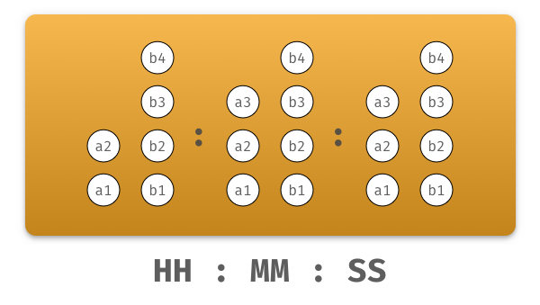

# Binary Clock Core
Implementation of the core logic for a binary clock.

## Features
- `~320 Bytes` & 0 dependencies

## Installation
```
npm install --save binary-clock-core
```

## Usage
The library has four core APIs
- `getTime`
- `getHours`
- `getMinutes`
- `getSeconds`

### 2. Using the core API

```
import * as clock from 'binary-clock-core';

const currDate = new Date();

clock.getTime(currDate);
clock.getHours(currDate);
clock.getMinutes(currDate);
clock.getSeconds(currDate);
```

### 3. Sample output

Use the clock coordinates below to display a time unit.

```
{
  a3: 'Off',
  a2: 'On',
  a1: 'Off',
  b4: 'Off',
  b3: 'Off',
  b2: 'On',
  b1: 'Off'
}
```

### Clock Coordinates


